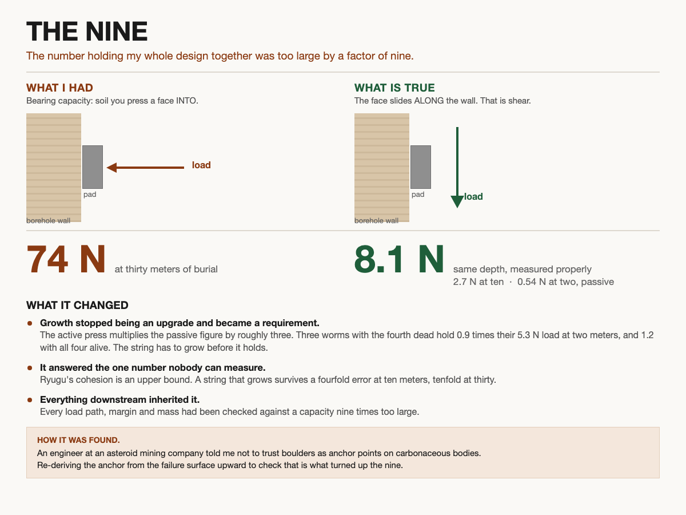
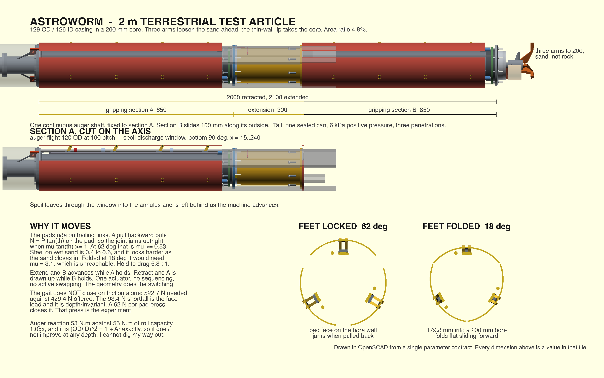

# astroworm

A burrowing anchor for asteroid mining. The buried body is the anchor.

Everything flown so far grabs at the surface of a body whose surface is weaker
than dry flour, with no gravity to react against. This goes under it. The worm
is a string of casing sections that burrows, and holding capacity comes from the
buried length, not from the tip.

The number holding the design together was too large by a factor of nine. I
found it, and I write down the wrong number, the right number, and what changed.

A two meter test article, burrowed horizontally into wet sand, 2026.

Dylan Leitenberg
