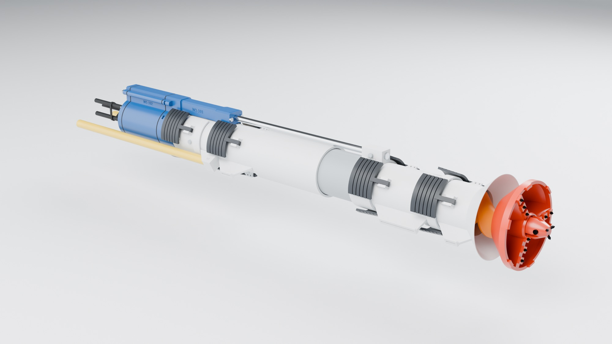
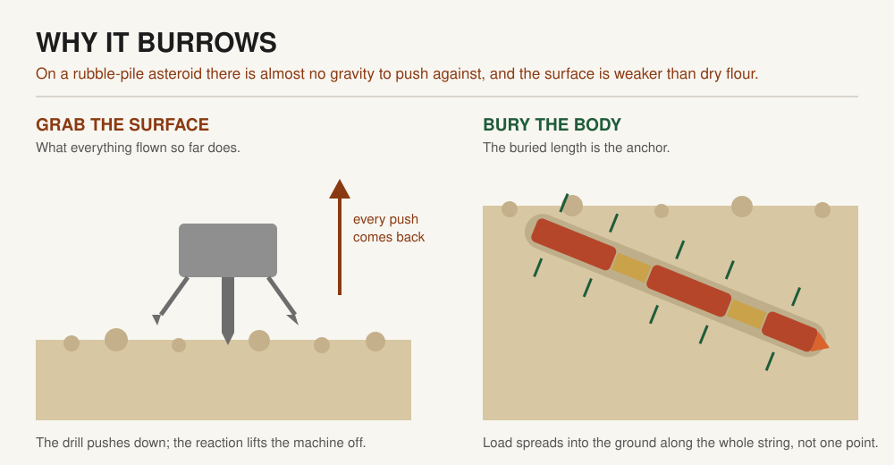
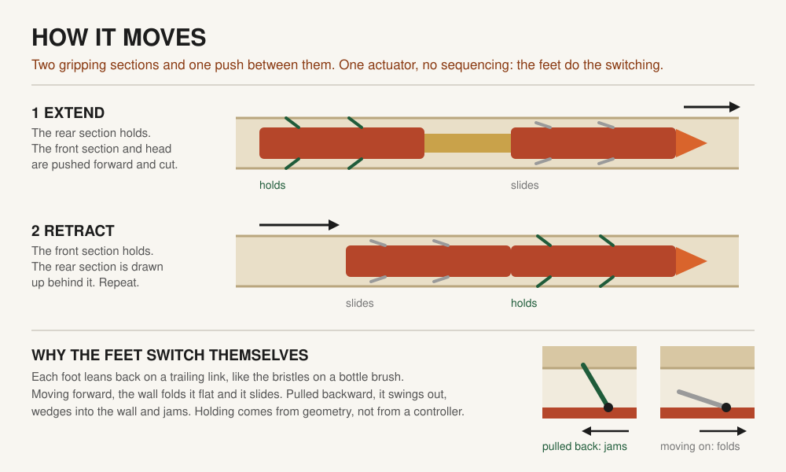
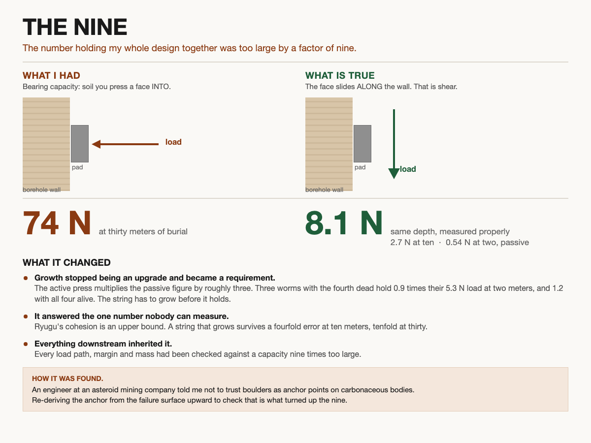
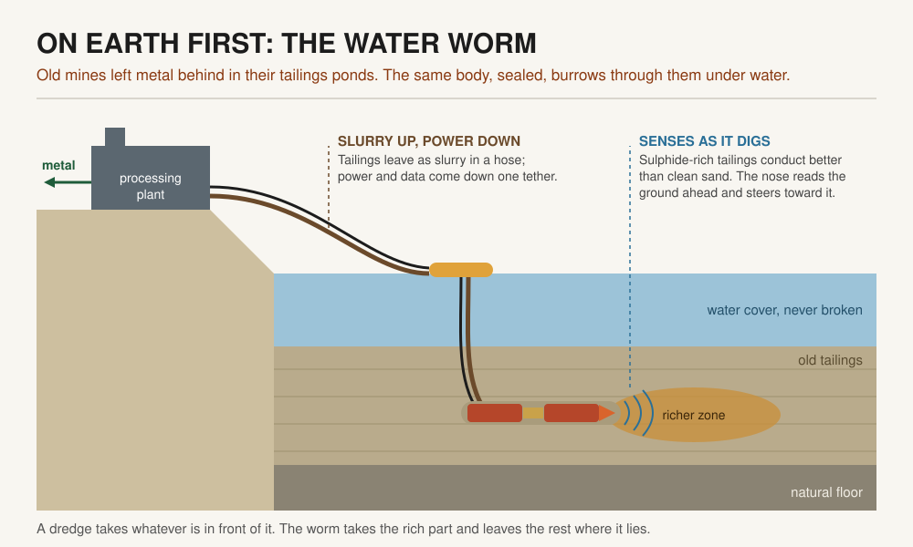
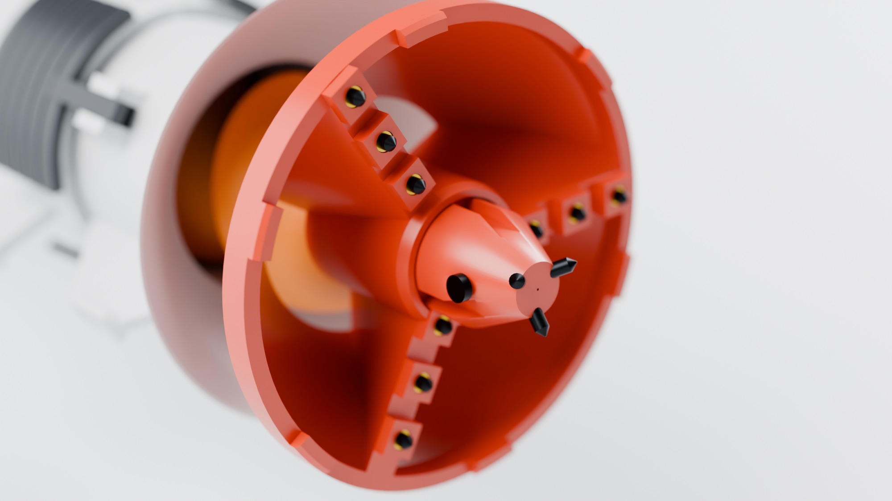
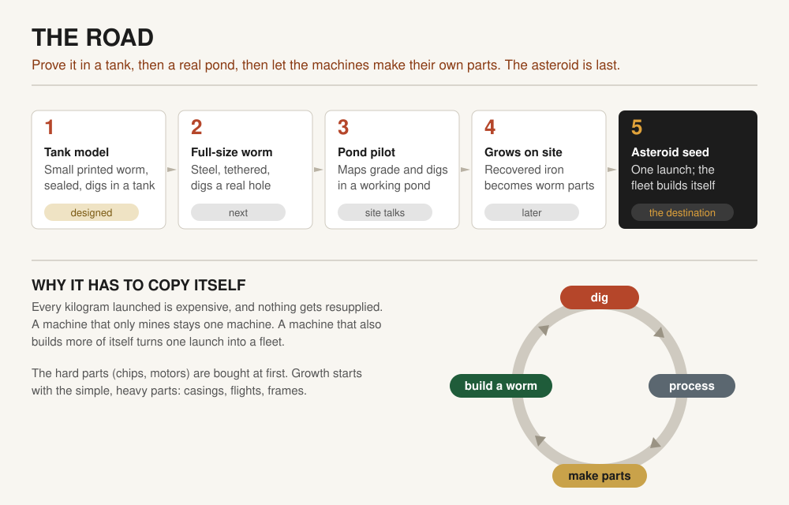
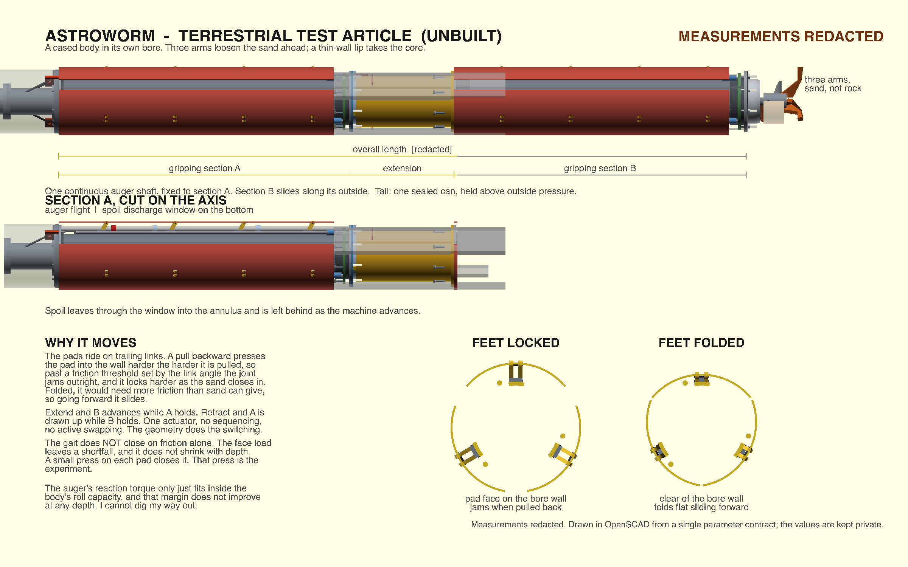

# astroworm

A burrowing anchor for asteroid mining. The buried body is the anchor.

*Water Worm W1, a tank-test model of the same body, sealed for work under water.
Rendered from CAD. Not yet built.*

## The problem

Everything flown so far grabs at the surface of a body whose surface is weaker
than dry flour, with no gravity to react against. Every push a machine makes on
the ground comes back and pushes the machine off.

This goes under it. The worm is a string of casing sections that burrows, and
holding capacity comes from the buried length, not from the tip.

## How it moves

Two gripping sections with one push between them. The feet lean back on
trailing links, so they fold and slide going forward and jam going backward.
The geometry does the switching: one actuator, no sequencing, no controller
deciding which end holds.

## The nine

The number holding the design together was too large by a factor of nine. I
found it, and I write down the wrong number, the right number, and what changed.

## On Earth first: the water worm

A century of mining left metal in tailings ponds, because the mills of the time
could not recover all of it. The same body, sealed, burrows through those ponds
under water. It reads the ground ahead as it digs, takes the richer material,
and sends it up a hose as slurry to a processing plant. The water cover over the
tailings is never broken.

*The cutting head of the tank model: a crown of picks around a pilot bit,
matched to the asteroid version.*

## The road

The asteroid is the reason the machine has to copy itself: nothing gets
resupplied, so one launch has to become a fleet. The ponds are where that gets
proven, one step at a time, on ground that can be reached by truck.

## Status

| | |
|---|---|
| Asteroid anchor (the worm) | Designed in CAD; load paths and anchoring analysed |
| Terrestrial test article | Drawn, **not built** |
| Water Worm W1 (tank model) | Designed in CAD, layout and leak checks pass, **not built** |
| Full-size water worm | Concept; first-prototype budget estimated |
| Pond pilot | A mine operator has agreed to share site data |

Unbuilt things are labelled unbuilt. When something is tested, the result goes
here, including when it fails.

## The terrestrial test article

*Unbuilt. General arrangement for a terrestrial test article of the worm, to be
run horizontally in wet sand. Measurements redacted.*

## What is not here

Dimensions, part lists, CAD and the analysis are kept private. This page shows
how the machine works, not how to make it.

Dylan Leitenberg · [parahuman.net](https://parahuman.net)
